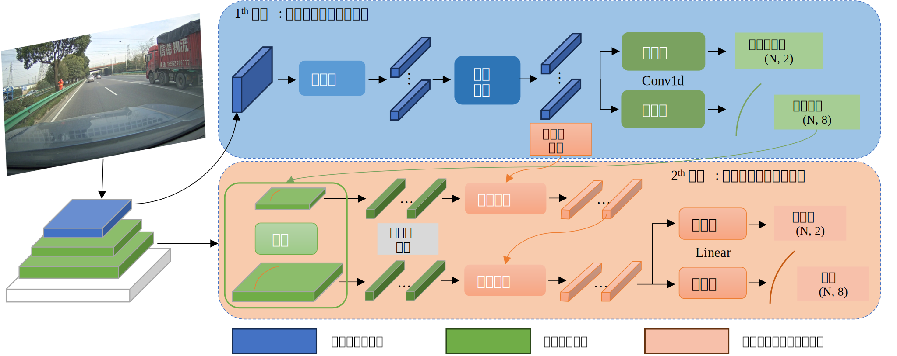

# 稀疏高质量查询优化的车道线检测

> 毕业论文第四章

## 摘要

针对基于无参考的车道线检测方法中存在的查询成本高、查询特征表征模糊以及查询特征区分度不足的问题，本研究提出了一种稀疏高质量查询优化驱动的高效车道线检测方法，构建了高质量查询初始化网络，通过网络学习来对查询初始化，解决车道线查询表征模糊的问题；设计了车道线特征层次化稀疏查询策略，通过跨层次指定区域查询，实现轻量级的车道线多尺度特征查询以及融合；实现了基于空间约束的匈牙利标签匹配方法，通过最大池化操作增强查询特征的区分度，缓解模型收敛困难问题。实验表明，在ResNet-18主干网络上，该方法在 VIL100 数据集上mIoU 、F1 、Accary 、FP、 FN 指标分别达到了 86.6%、92.7%、94.8%、4.8%、4.7%，均达到基于单帧方法的SOTA水平。

## Results and Visualization
