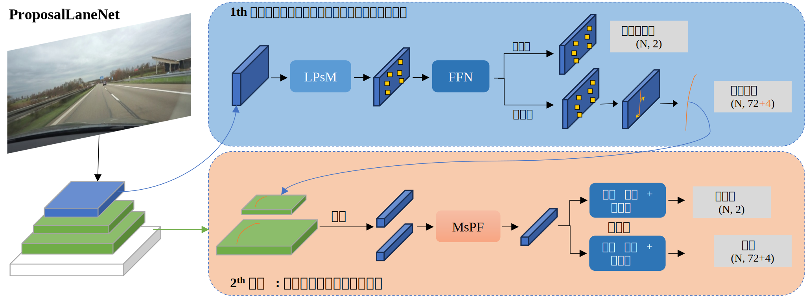

# 稀疏高质量提议驱动的高效车道线检测

> 毕业论文第三章

## 摘要

针对基于显示参考的车道线检测方法存在复杂形状适应性差、特征计算冗余等问题，提出了一种稀疏高质量提议驱动的高效车道线检测方法，设计了质量引导的显式参考生成策略，通过生成稀疏自适应的显式参考以及高质量提议，提高了显式参考对于车道复杂形状的适应能力；构建了多尺度提议特征融合模块，通过对多尺度的高质量提议特征进行融合，解决了整图的元素级运算与车道线稀疏分布特性之间的冲突，进而使用更少特征实现较高精度的车道线线检测。实验表明，在ResNet-18主干网络上，本方法相较于SOTA算法CLRNet，在 CULane 数据集上 F1 分数从 79.58% 提升到 80.38% ， 推理速度提升30%且计算量降低10%。

## 定量结果

## 定性结果

